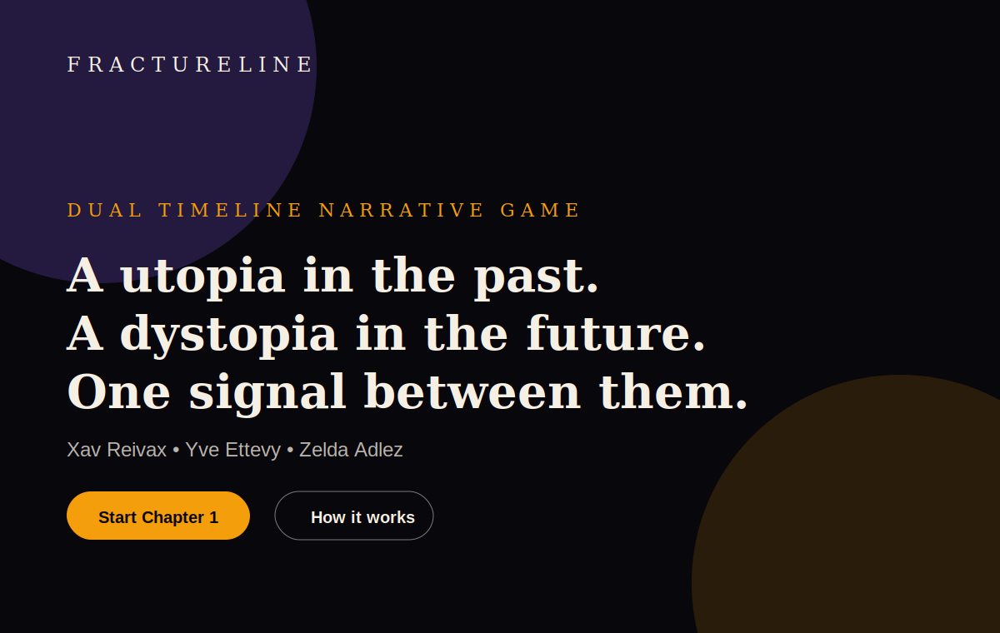
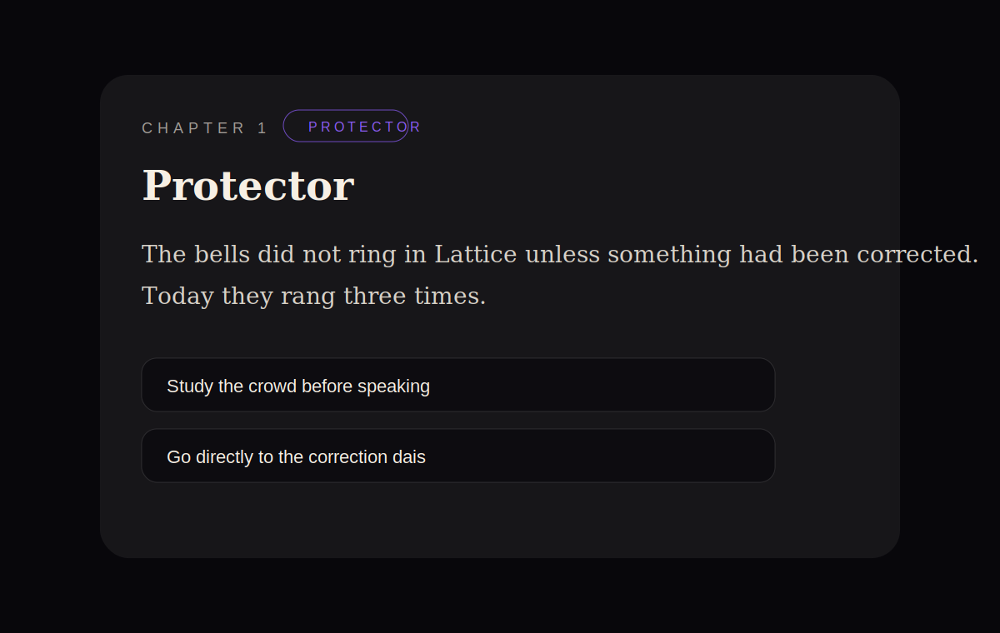
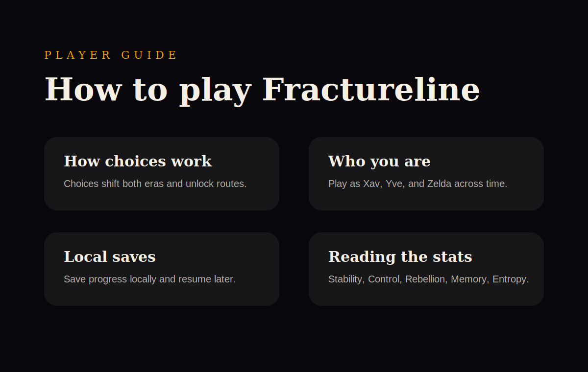

# Fractureline

A dual-perspective text-based narrative web game where choices in the present and future rewrite each other.

## Screenshots

### Home



### Play



### Help



Playwright also captures generated screenshots during CI and uploads them as the `app-screenshots` artifact.

## Stack

- Next.js App Router
- TypeScript
- Material UI
- Tailwind CSS for global utility styling
- Zustand
- Dexie and IndexedDB for local-first saves
- Vitest
- Playwright
- Storybook
- Vercel
- PWA install and offline shell powered by `@ducanh2912/next-pwa` and Workbox

## Repository Structure

```text
apps/web                      Next.js app
packages/shared-types         Shared contracts
packages/narrative-engine     Pure branching logic
.bmad-core                    BMAD agents and workflow files
docs                          Product, architecture, QA, deployment, and planning docs
supabase                      Optional future cloud-sync planning docs and migrations
.github/workflows             CI jobs
```

## Commands

```bash
pnpm install
pnpm dev
pnpm build
pnpm lint
pnpm test
pnpm test:coverage
pnpm test:e2e
pnpm storybook
pnpm build-storybook
```

## Web App

The app currently includes:

- `/` landing page
- `/play` playable Chapter 1 plus unlocked Chapter 2 and Chapter 3 continuation based on ending path
- `/help` gameplay, PWA, and testing help page
- Material UI theme provider
- installable PWA manifest
- generated Workbox service worker in production builds
- offline fallback page

Chapter 2 route packs currently included:

- `The Stable Signal` (`signal-path`)
- `The Firstborn Record` (`family-path`)
- `The Second Future` (`history-path`)

Each Chapter 2 route now targets a 20+ minute reading baseline (minimum 3,000 words at ~150 WPM), with manifest estimates set to 22 minutes per route.

Chapter 3 foundation route packs currently included:

- `The Relay Accord` (`signal-path`)
- `The Witness Ledger` (`family-path`)
- `The Public Memory Trial` (`history-path`)

## Local-First Saves

Fractureline stores MVP saves locally using Dexie and IndexedDB. Local saves are intended to work offline and without a user account. See `docs/LOCAL_FIRST_STORAGE.md` for the storage plan.

Supabase is kept only as optional future cloud-sync planning. It is not required for MVP play.

## BMAD Method

BMAD files are included in two places:

- `.bmad-core/agents`: individual agent definitions
- `.bmad-core/workflows`: launch workflow and handoff order
- `docs/AGENT_PROMPTS.md`: prompt-facing agent descriptions
- `docs/BMAD_WORKFLOW.md`: broader workflow explanation

Initial agents include:

- Product Manager
- Architect
- Narrative Designer
- UI Agent
- Backend
- QA
- Growth
- Producer

## Testing

Unit tests live in package-level test files, including Chapter 2 duration guardrails and cache behavior checks (`apps/web/content/chapter-two-duration.test.ts`, `apps/web/lib/chapter-packs/chapter-pack-cache.test.ts`) plus narrative-engine regression suites (`packages/narrative-engine/src/coverage-regression.test.ts`).

End-to-end tests live in `apps/web/tests/e2e` and cover:

- home page navigation
- play flow from Protector to Dissenter
- IndexedDB save/load behavior
- deterministic Chapter 1 completion
- help page content
- static PWA assets in development
- screenshot capture for documentation

## GitHub Workflows

`.github/workflows/ci.yml` contains separate jobs for:

- linting
- unit tests
- Next.js build
- Storybook style guide build
- Playwright e2e tests

The workflow uploads Playwright reports, generated screenshots, Storybook static output, and Next.js build output as artifacts.

When dependencies change, run the temporary `Refresh pnpm lockfile` workflow before relying on CI or Vercel frozen-lockfile installs.

## Vercel Deployment

The repository includes `vercel.json` for monorepo deployment.

Recommended project settings:

- Framework preset: Next.js
- Install command: `pnpm install --frozen-lockfile`
- Build command: `pnpm build`

See `docs/DEPLOYMENT.md` for details.

## PWA / Offline

The app uses `@ducanh2912/next-pwa` to generate Workbox service-worker artifacts during production builds. The generated files are ignored because they are build artifacts.

Checked-in PWA assets include:

- `apps/web/public/manifest.webmanifest`
- `apps/web/public/offline.html`
- `apps/web/public/icons/icon.svg`

The app registers the generated service worker with `workbox-window` and shows an update prompt when a new version is waiting.

## Storybook

Storybook is configured in `apps/web/.storybook` and includes Material UI style-guide stories in `apps/web/stories`.

See `docs/STORYBOOK.md` for next style-guide tasks.

## Next Steps

See `docs/NEXT_STEPS.md` for the follow-up roadmap. Immediate priorities are CI/Vercel verification, PWA production validation, Storybook expansion, narrative expansion, and local-first storage hardening.
